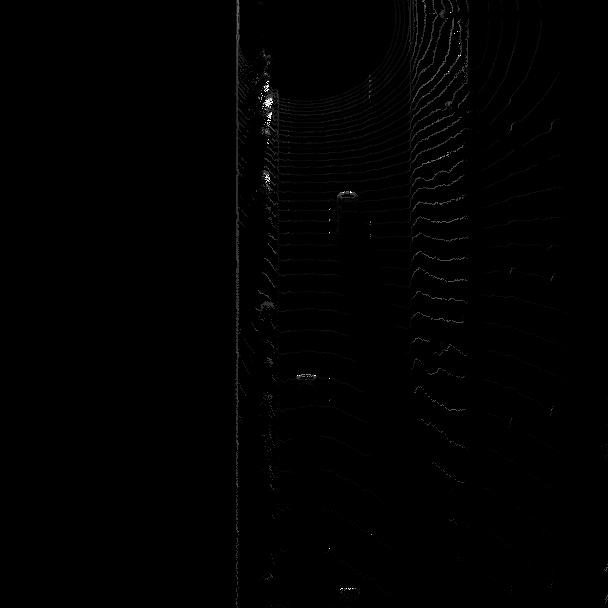
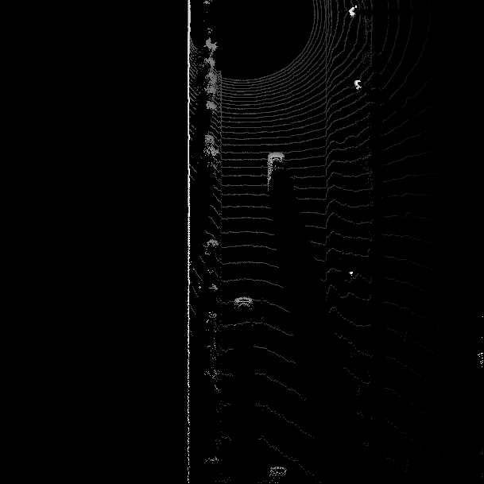

# Writeup: Track 3D-Objects Over Time

## Step 1. Compute Lidar Point-Cloud from Range Image

### 1-A. Visualize range image channels

The image below shows the extracted range image from frame 0 in  360° surround view and a symmetric +/-90° center crop of the stacked range and intensity channels:

The image below shows the extracted range image from frame 1 in  360° surround view and a symmetric +/-90° center crop of the stacked range and intensity channels:

### 1-B. Visualize point-cloud 

In the image below, the first LIDAR return/response image shows a vehicle that is not fully detected, which could affect the object detection module in later stages when the full shape of a vehicle is not recognized:

*Fig. 1*

The examples below show how the side glasses and windshields of nearby vehicles are undetected by the LIDAR, which could be a factor in determining the vehicle shapes:

*Fig. 2*

*Fig. 3*

The examples below show how the nearby vehicles are partially detected due to the blind spot of the LIDAR detection:

*Fig. 4*

*Fig. 5*

 *Fig. 6*

*Fig. 7*

*Fig. 8*

## Step 2. Create Birds-Eye View from Lidar PCL
### 2-A. Convert sensor coordinates to bev-map coordinates

The image below shows the sensor coordinates converted to BEV-map coordinates:

### 2-B. Compute intensity layer of bev-map

The image below shows the intensity channel of the BEV-map computed above:

### 2-C. Compute height layer of bev-map

The image below shows the height channel of the BEV-map computed above:

## Step 3. Model-based Object Detection in BEV Image

In this step we:
* Add a second model from a GitHub repo
* 3-B. Extract 3D bounding boxes from model response 

The image below shows the model response of detecting a 3D object in bird's eye view (BEV):

## Step 4. Performance Evaluation for Object Detection

In this step we compute:
* Intersection-over-union (IOU) between labels and detections 
* False-negatives and false-positives 
* Precision and recall

The figures below show the performance evaluation of object detection using darknet model (first image) compared to the performance evaluation of object detecting using fpn_resnet model (second image), where it shows that resnet has a higher chance of correctly detecting an object (precision):

The performance evaluation of object detecting using fpn_resnet model:

