# Writeup: Track 3D-Objects Over Time

## Compute Lidar Point-Cloud from Range Image

### Visualize range image channels
Range image - Frame 0:
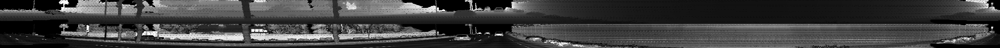
Range image - Frame 0 - Cropped to center:
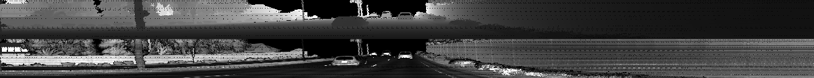
Range image - Frame 1:
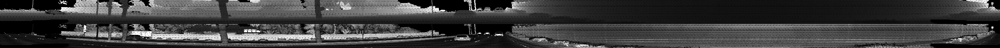
Range image - Frame 1 - Cropped to center:
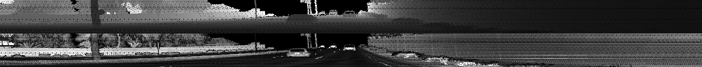

### Visualize point-cloud 

In the image below, the first return/response image shows a vehicle that is not fully detected, which could affect the object detection module in later stages when the full shape of a vehicle is not recognized:

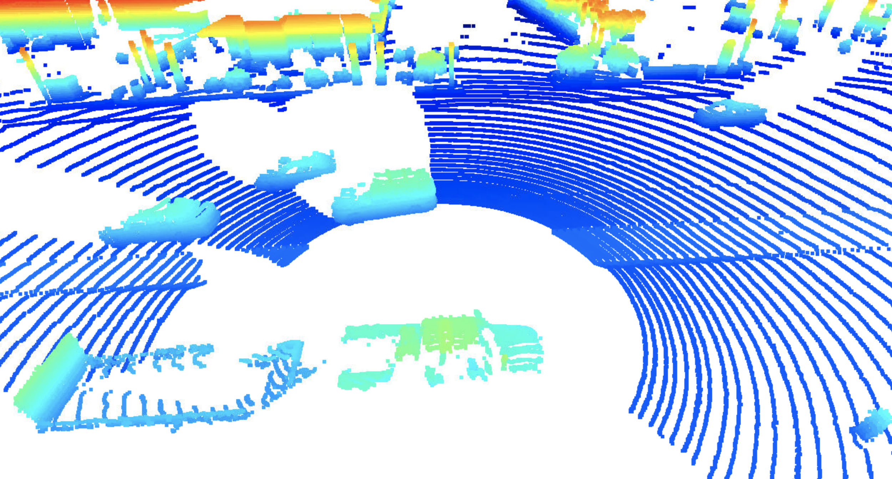

In the examples below show how the side glasses and windshields of nearby vehicles are undetected by the LIDAR, which could be a factor in determining the vehicle shapes:

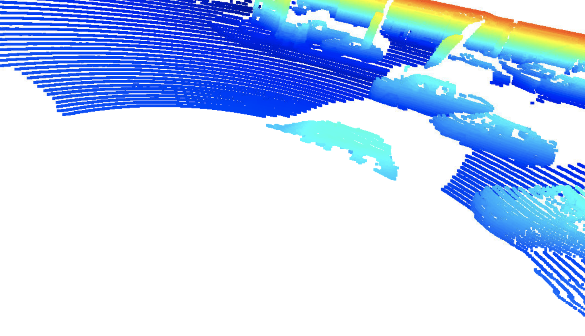

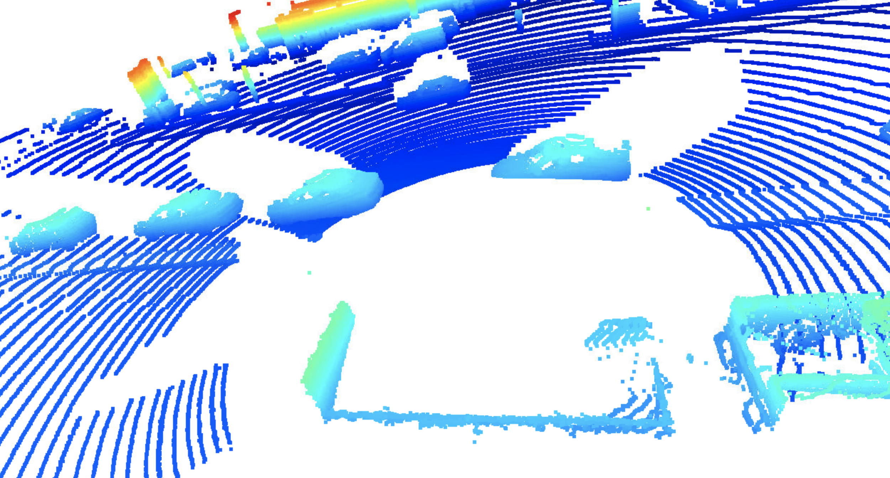

The examples below show how the nearby vehicles are partially detected due to the blind spot of the LIDAR detection:

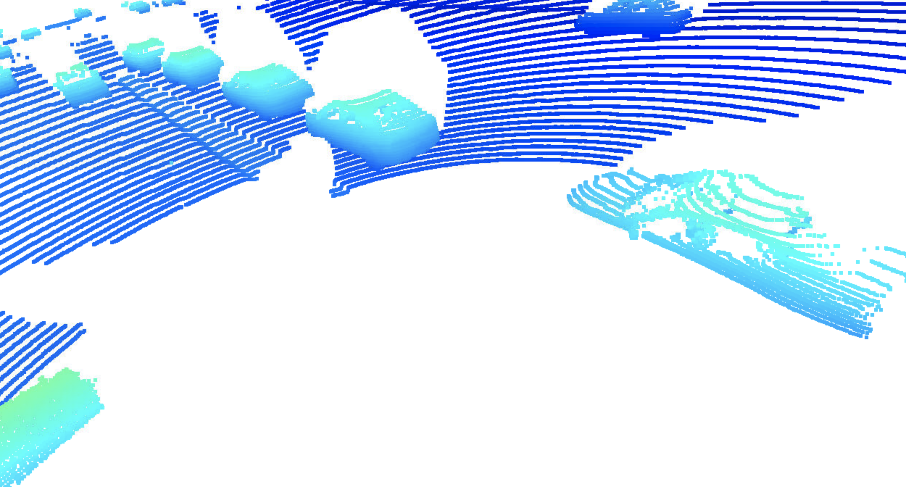

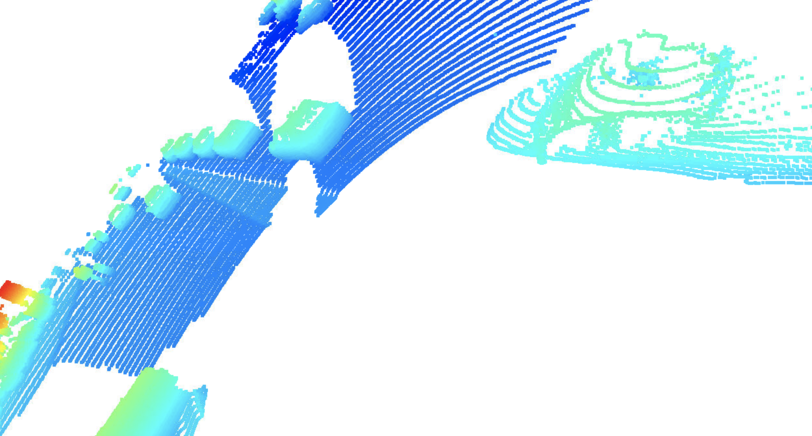

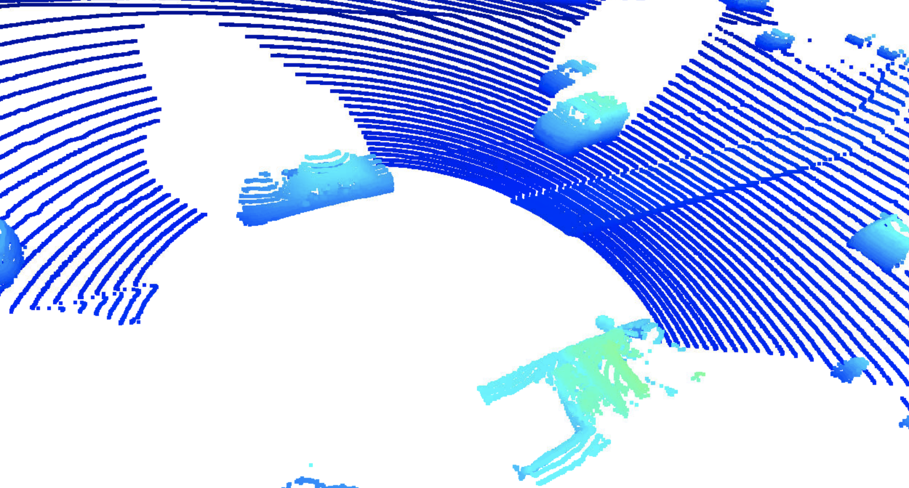

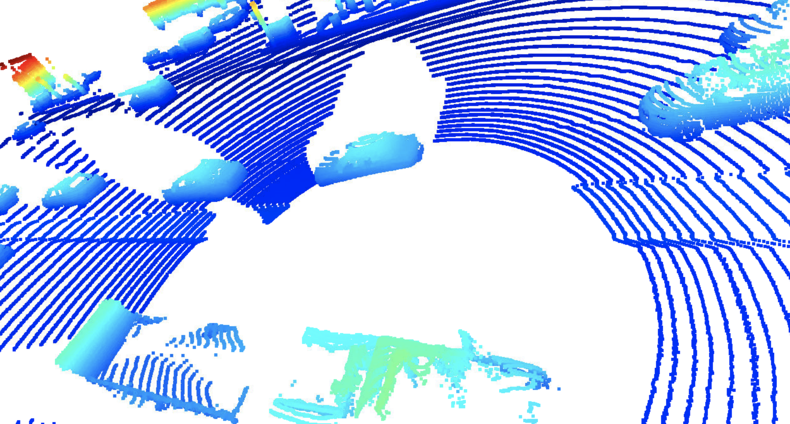

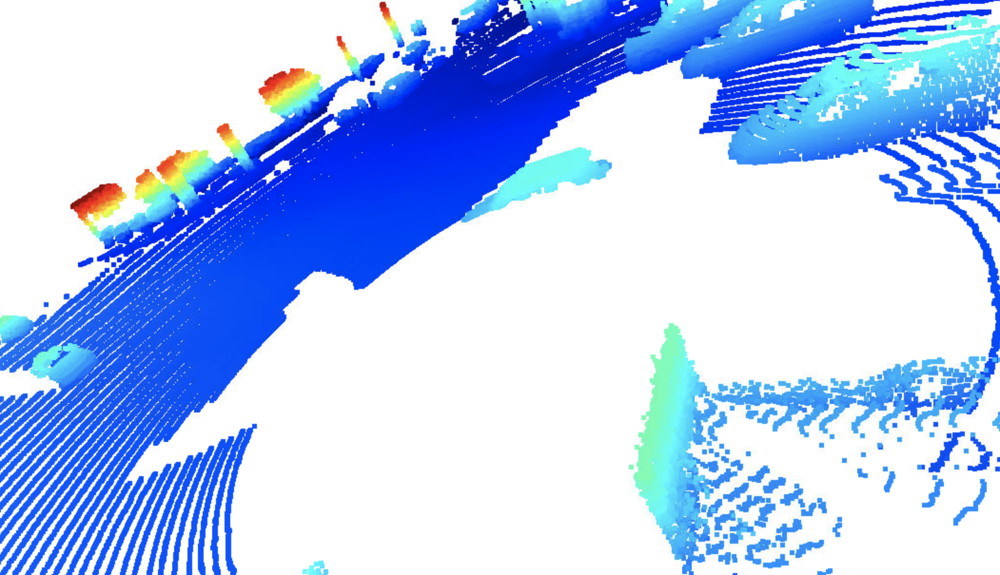

## Create Birds-Eye View from Lidar PCL
### Convert sensor coordinates to bev-map coordinates
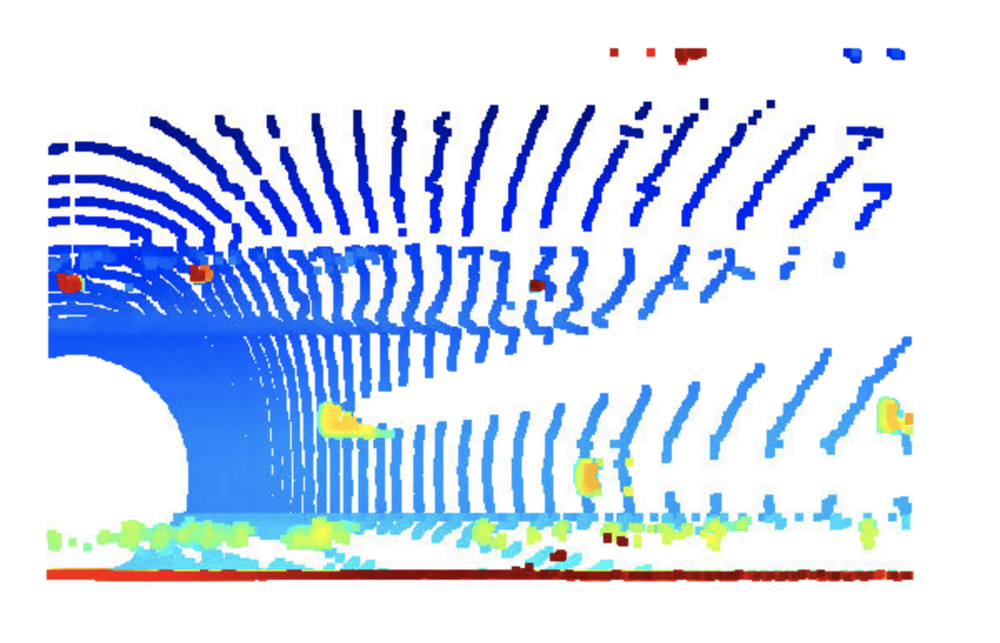
### Compute intensity layer of bev-map

### Compute height layer of bev-map

## Model-based Object Detection in BEV Image
### Add a second model from a GitHub repo
### Extract 3D bounding boxes from model response 
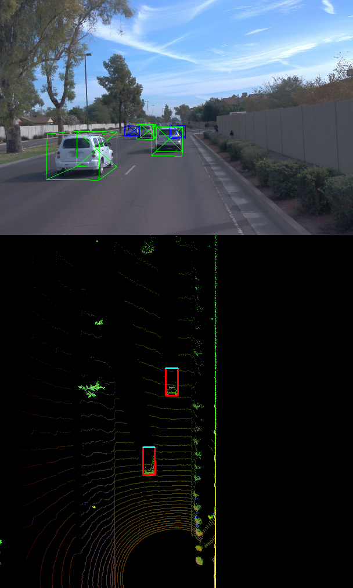

## Performance Evaluation for Object Detection

The figures below show the performance of darknet (first image) compared to the performance evaluation of fpn_resnet (second image), where it shows that resnet has a higher chance of correctly detecting an object

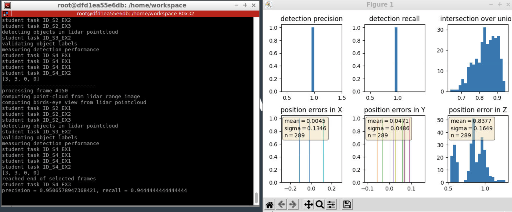

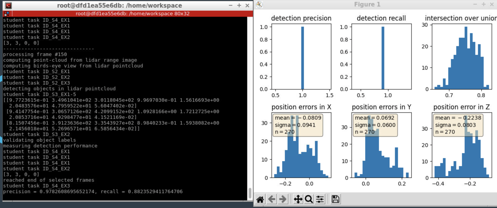

### Compute intersection-over-union (IOU) between labels and detections 
### Compute false-negatives and false-positives 
### Compute precision and recall
