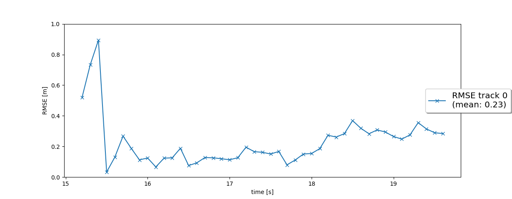
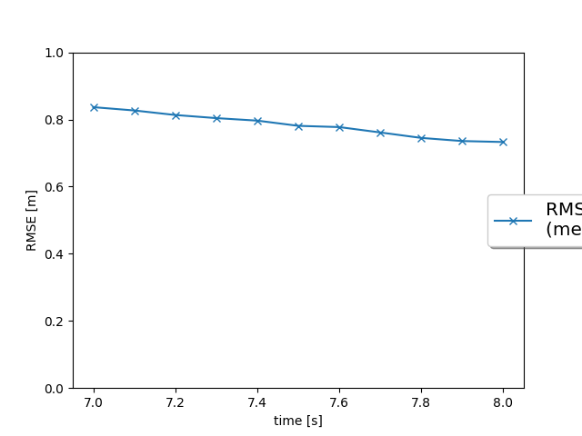
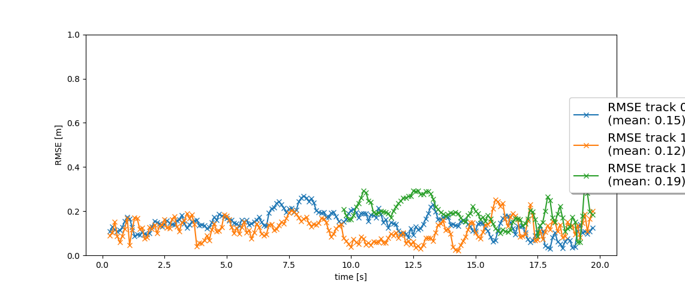
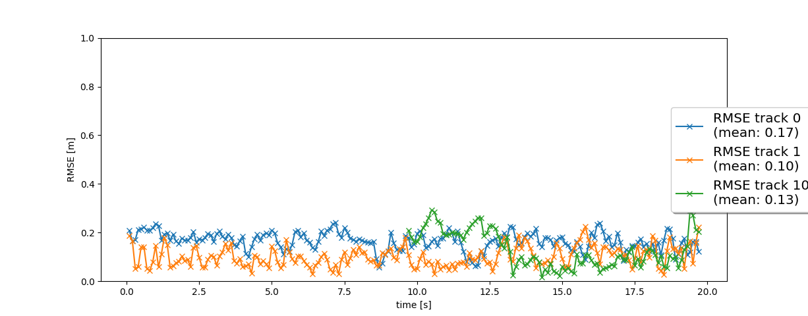

# Writeup - Final Project: Track 3D-Objects Over Time

## Step 1. Tracking

### Track objects over time with a Kalman Filter

This step includes the following:
* Design the system state `[x, y, z, vx, vy, vz]` using a constant velocity motion 3D model.
* Compute system matrix `F()` and system noise `Q` for constant velocity motion 3D model.
* Predict track state `[x, y, z]` and estimation covariance `P`, based on `F()`, `Q()`; evaluate measurement function with `get_hx` and its Jacobian `get_H` and update the predictions with the Jacobian matrix `H` according to Kalman Filter update equations.

The resultant RMSE plot of the single-object tracking using a single sensor (LIDAR) is shown below:

## Step 2. Track Management
### Initialize, update and delete tracks

This step includes the following:
* Initialize `track.x` and `track.P` based on unassigned measurement `meas`, which is transformed from sensor coordinate to vehicle coordinate; Initialize track state as `initialized` and track score as `1/params.window`.
* For scores on one track, increase the track score if it is associated with a measurement, and decrease the score otherwise.
* Update track states to `tentative` or `confirmed` based on the corresponding scores.
* Delete a track in the track list if the score is below a threshold or its estimation-error covariance `track.P` is too large.

The resultant RMSE plot of the single-object tracking using a single sensor (LIDAR) is shown below:

## Step 3. Data Association

This step includes the following:
* Construct an association matrix by computing Mahalanobis distance between a track and its measurement.
* Exclude unlikely pairs using 'gating()' based on Chi-Square distribution
* Re-initialize the list of unassigned measurements `unassigned_meas` and unassigned tracks `unassigned_tracks`.
* Find the minimum entry in `association_matrix`, delete corresponding row and column from the matrix.
* Remove corresponding track and measurement from `unassigned_tracks` and `unassigned_meas`.
* Return this association pair between track and measurement. If no more association was found, i.e. the minimum matrix entry is infinity, return `numpy.nan` for the track and measurement.

The resultant RMSE plot of multi-object tracking using a single sensor (LIDAR) is shown below:

## Step 4. Sensor Fusion

In this step we compute SWBAT fuse measurements from lidar and camera.
This step includes the following:
* Initialize camera measurement objects using measurement vector `z` and covariance matrix of camera measurement noise `R`
* Apply nonlinear camera measurement function to transform state estimates in vehicle coordinates to image coordinates
* Use `in_fov` to check whether an object can be seen by this sensor; Reject track and measurement pair if `in_fov` returns `False`

The resultant RMSE plot of multi-object tracking using fusion of multiple sensors (LIDAR \ Camera) is shown below:

The tracking movie is included in the 

# Evaluation and Conclusion

## Implementation Challenges
Debugging and setting up the sensor fusion between camera and LIDAR is challenging due to the computation of measurement-prediction residual which could result into meaningless Mahalanobis distances between tracks and camera measurements.

## Sensor Fusion and Challenges
Since each sensor has its advantages and disadvantages, an optimal self-driving car system should leverage the advantages of every world (for example, the precision of LIDAR sensors and the richness of cameras). As shown in the output of Step 3 and 4, tracking based on sensor fusion of camera and LiDAR, provides much less RMSE than relying solely on LIDAR.

Some of the challenges that could face sensor fusion in real-world are:
* The difference between the visibility of each sensor which leads to varying track scores. 
* Complexity for data association can increase as more vehicles are detected. In this project, gating method is applied to remove unlikely association pair of detected tracks and measurements to speed up the data association process to make prompt tracking.

## Further Improvements

In the future, the following improvements could be further applied to our tracking and sensor fusion algorithm:
* Use a non-linear motion model such as the bicycle model which is more appropriate for vehicle movement than our linear motion model.
* A more advanced data association algorithm, e.g. Global Nearest Neighbor (GNN) or Joint Probabilistic Data Association (JPDA), can substitute the simplest Single Nearest Neighbor (SNN).
